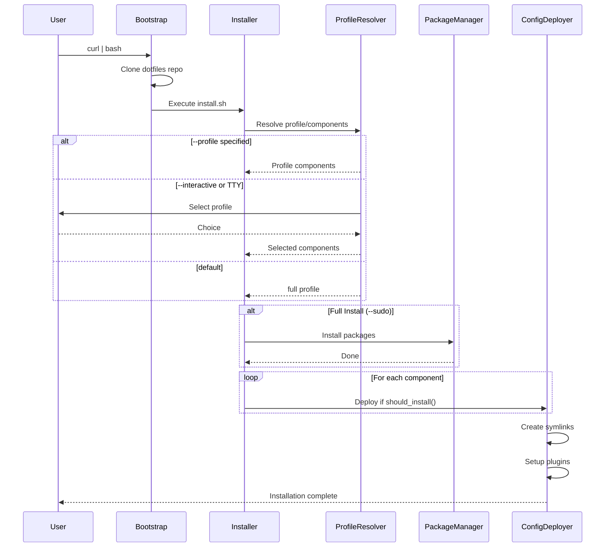

# Dotfiles Architecture

Comprehensive documentation of the dotfiles system architecture, workflows, and components.

## Overview


## System Components

### 1. Entry Points


### 2. Installation Flow



### 2.1 Profile-Based Installation


### 2.2 Profile Definitions

| Profile | Components | Use Case |
|---------|------------|----------|
| `minimal` | zsh, git, editorconfig | Servers, VMs |
| `deploy` | minimal + docker | CI/CD, containers |
| `development` | deploy + vim, tmux, vscode | Workstations |
| `full` | development + claude | Power users |

**Unix/Linux Components:**
```
zsh         → Zinit, Starship, zoxide, fzf, plugins
vim         → vim-plug, Neovim, 40+ plugins
tmux        → TPM, gpakosz config
git         → .gitconfig, .gitignore_global
vscode      → settings.json, keybindings, extensions
claude      → settings.json, CLAUDE.md
editorconfig→ .editorconfig
docker      → lazydocker (Linux only)
```

**Windows Components:**
```
system      → Cursor size, hibernate
bloatware   → Remove 80+ apps
telemetry   → Disable tracking/ads
cli-basic   → git, fzf, ripgrep
cli-full    → neovim, fd, bat, eza, delta, zoxide, starship, jq, yq
tui         → lazygit, lazydocker, btop
devtools    → Node.js, Python, Go, Docker
apps        → Chrome, VSCode, Terminal
font        → MesloLGS Nerd Font
git         → .gitconfig
vscode      → settings, extensions
claude      → CLI, settings, CLAUDE.md
profile     → PowerShell profile
```

### 3. Package Installation


## Configuration Deployment

### File Mapping


### Windows Deployment


## Shell Environment

### Zsh Initialization

```mermaid
flowchart TD
    A[Terminal Start] --> B[/etc/zshenv]
    B --> C[~/.zshenv]
    C --> D[~/.zshrc]

    D --> E[Zinit Init]
    E --> F[Load Plugins]

    F --> G[zsh-autosuggestions]
    F --> H[zsh-syntax-highlighting]
    F --> I[zsh-completions]
    F --> J[fzf-tab]

    D --> K[Starship Init]
    K --> L[Load starship.toml]

    D --> M[Zoxide Init]
    D --> N[FZF Init]
    D --> O[Aliases & Functions]

    O --> P[Modern CLI Aliases]
    P --> Q[eza → ls]
    P --> R[bat → cat]
    P --> S[delta → diff]
```

### Plugin Loading (Turbo Mode)


## Claude Code Configuration

### Permission Flow


### MCP Server Integration


## Remote Deployment

### SSH Workflow


### Machine Configuration


## TUI Application

### Screen Flow


### Component Architecture


## Windows Setup Process

### Profile-Based Installation


### Windows Profile Components

| Profile | Components Installed |
|---------|---------------------|
| `minimal` | system, bloatware, telemetry, git, cli-basic |
| `deploy` | minimal + docker |
| `development` | deploy + cli-full, tui, devtools, vscode, apps, font, profile |
| `full` | development + claude |

### Step-by-Step Flow (Full Profile)


## Directory Structure


## Version Control

### Git Workflow


### Commit Convention


## Security Model

### Permissions Flow

```mermaid
flowchart TD
    A[User Request] --> B{Requires Sudo?}

    B -->|Yes| C{--sudo flag?}
    B -->|No| D[Execute]

    C -->|Yes| E[Run with sudo]
    C -->|No| F[Skip/Warn]

    E --> G{Admin Check}
    G -->|Pass| H[Execute]
    G -->|Fail| I[Error]

    subgraph "Sudo Operations"
        J[Package Install]
        K[System Config]
        L[Hibernate Control]
    end

    subgraph "Non-Sudo Operations"
        M[Config Symlinks]
        N[User Directories]
        O[Shell Plugins]
    end
```

### Sensitive Data Handling

```mermaid
flowchart LR
    A[machines.yaml] -->|gitignore| B[Not Tracked]
    C[machines.yaml.example] --> D[Tracked Template]

    E[.gitignore] --> F{File Type}
    F --> G[*.local - Excluded]
    F --> H[machines.yaml - Excluded]
    F --> I[.DS_Store - Excluded]

    J[Passwords in YAML] --> K[Local Only]
    K --> L[SSH Auth]
```

## Troubleshooting Flow

```mermaid
flowchart TD
    A[Issue] --> B{Category?}

    B -->|Zinit| C[rm -rf ~/.local/share/zinit]
    B -->|Starship| D[starship --version]
    B -->|Vim Plugins| E[vim +PlugInstall +qall]
    B -->|Tmux| F[Prefix + I]
    B -->|Icons| G[Install Nerd Font]
    B -->|zoxide| H[Visit directories first]

    C --> I[exec zsh]
    D --> J[curl install script]
    E --> K[Plugins installed]
    F --> L[TPM plugins installed]
    G --> M[Set terminal font]
    H --> N[z command works]
```

## Platform Comparison

| Feature | macOS | Ubuntu | Rocky | Manjaro | Windows |
|---------|-------|--------|-------|---------|---------|
| Package Manager | Homebrew | apt | dnf | pacman | winget |
| Shell | zsh | zsh | zsh | zsh | PowerShell |
| Config Method | symlink | symlink | symlink | symlink | copy |
| Claude CLI | npm | npm | npm | npm | npm |
| Nerd Font | brew cask | manual | manual | pacman | download |
| One-liner | curl\|bash | curl\|bash | curl\|bash | curl\|bash | irm\|iex |

## Future Enhancements

```mermaid
timeline
    title Roadmap
    section Phase 1
        WSL Support : Windows Subsystem for Linux
        Better TUI : Rich progress bars
    section Phase 2
        Nix Support : Cross-platform packages
        Ansible : Enterprise deployment
    section Phase 3
        GUI Installer : Electron/Tauri app
        Cloud Sync : Settings backup
```
